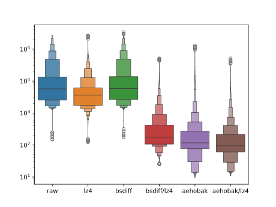

# bsdiff-analysis

Walks a forest of blobs compressed with bsdiff and LZ4.
The corpus is produced from Chromium build artifacts.
The corpus archive is compressed with pixz.



## Corpus construction

### Chromium build with siso and nativelink

For each tag:
```
144.0.7518.0
144.0.7519.0
144.0.7520.0
144.0.7521.0
```

With `depot_tools` on `PATH`, create this `.gclient` file and run `gclient sync --no-history`:
```python
solutions = [
  {
    "name": "src",
    "url": "https://chromium.googlesource.com/chromium/src.git@144.0.7518.0",
    "managed": False,
    "custom_deps": {},
    "custom_vars": {},
  },
]
target_os = [ 'linux', 'android' ]
```

Under `src`, run `gn args out/Default` and set the following:
```toml
target_os = "android"
target_cpu = "arm64"
use_remoteexec = true
is_debug = false
android_static_analysis = "off"
```

Set up `nativelink 0.7.5` with this CAS store configuration:
```json5
{
  stores: [
    {
      name: 'RAW_STORE',
      memory: {},
    },
    {
      name: 'BSDIFF_STORE',
      size_partitioning: {
        size: 1280,
        lower_store: {
          ref_store: {
            name: 'RAW_STORE',
          },
        },
        upper_store: {
          // Store for bsdiff testing
        },
      },
    },
    {
      name: 'CONTENT_STORE',
      size_partitioning: {
        size: 1280,
        lower_store: {
          ref_store: {
            name: 'RAW_STORE',
          },
        },
        upper_store: {
          dedup: {
            index_store: {
              memory: {},
            },
            content_store: {
              ref_store: {
                name: 'BSDIFF_STORE',
              },
            },
            min_size: '32768',
            normal_size: '92682',
            max_size: '262144',
          },
        },
      },
    }
  ]
}
```

Configure your `siso` environment for `nativelink` and run:
```
siso ninja -C out/Default chrome_public_apk
```

The blobs collected in `BSDIFF_STORE` but not `RAW_STORE` form the content of this corpus.

### Construct an approximally minimal spanning arborescence

I have a truly marvelous implementation that this margin is too narrow to contain, but see:
* Trend Micro Locality Sensitive Hash
* Hierarchical Navigable Small World
* bsdiff
* LZ4
* Tarjan's refinement of the Chu-Liu/Edmonds algorithm
* Priority queue

### Construct the corpus archive

* Stored in lexicographic order of edges labeled `preimage-hash/postimage-hash`.
* Where the preimage is the empty blob, just store LZ4-compressed postimage.
* Otherwise, compute the `bsdiff` patch and store it LZ4-compressed.
* Archive as `tar` in `xz`, using `pixz` to embed an index. (`.tpxz`)
